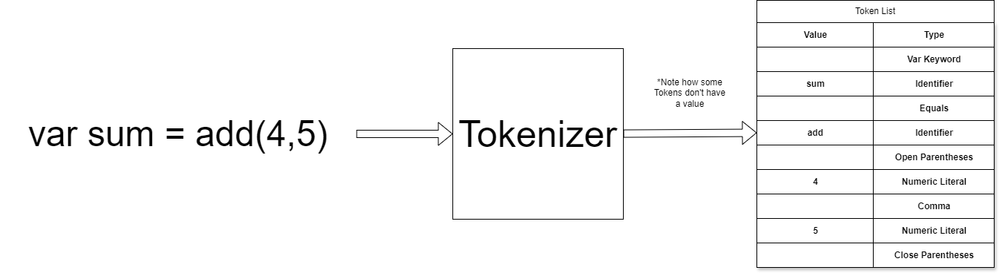

# Tokenizer
The Tokenizer is the first step in processing source code.

[Back](../../README.md)

---

The tokenizer takes in source code and creates a list of tokens. A example is shown above.

## Tokens
TODO: rewrite all of this
Tokens store two values, a type and a string titled value. The value string is used to store anything from a name to a number.

| Type |  Description |
| :--: | ---: |
| Numeric Literal | Number |
| String Literal | String |
| Identifier | The name of a variable, function, or struct |
| Binary Operation | The operations mentioned in [Expressions](./Expressions.md) |

W.I.P.
